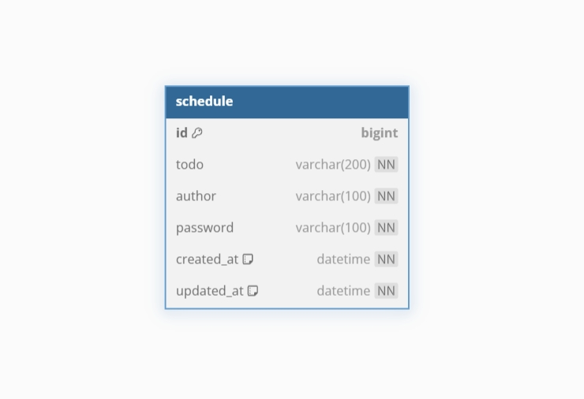

## 일정 관리 앱

### 🗓️ Schedule API 명세서

| 기능        | Method | URL        | request                                       | reponse   | 응답 코드                                         |
|-----------|--------|------------|-----------------------------------------------|-----------|-----------------------------------------------|
| 일정 생성     | POST   | /shcedules | body(todo, author, password)                  | 생성된 일정 정보 | **201 Created**                               |
| 전체 일정 조회  | GET    | /shcedules | param(author, updatedAt)                      | 일정 목록     | **200 OK**                                    |
| 선택 일정 조회  | GET    | /shcedules/{id} | path(id)                                      | 일정 정보     | **200 OK / 404 Not Found**                    |
| 선택한 일정 수정 | PATCH  | /shcedules/{id} | path(id), param(password), body(todo, author) | 수정된 일정 정보 | **200 OK / 401 Unauthorized / 404 Not Found** |
| 선택한 일정 삭제 | DELETE    | /shcedules/{id} | path(id), param(password)                     | -         | **204 No Content / 401 Unauthorized / 404 Not Found**      |

### 🔶 ERD

